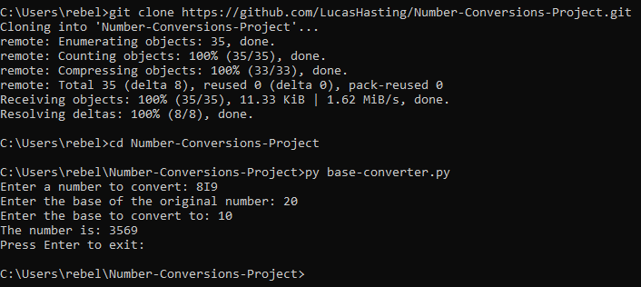

# Number Conversions Project

This program converts any base n number to a base m number where 1 ≤ n, m ≤ 36 and both n and m are integers. It uses logarithms to convert from base 10 to any base and it uses exponents to convert from any base to base 10.

## Table of Contents

- [Installation](#installation)
- [Usage](#usage)
- [Example](#example)
- [Program-Overview](#program-overview)

## Installation

This project does not require any external pip packages. You only need [Python](https://www.python.org/downloads/) installed on your system.

### Option 1: using [git](https://git-scm.com/downloads)
1. Clone the repository:

    ```sh
    git clone https://github.com/LucasHasting/Number-Conversions-Project.git
    ```

2. Navigate to the project directory and execute the program:

    ```sh
    cd Number-Conversions-Project
    py base-converter.py
    ```
### Option 2: without git
1. Download the project as a zip file
2. [Extract the zip file](https://www.wikihow.com/Unzip-a-File)
3. In windows, the subnetting.py file can be clicked to execute

#### Run from the command line
1. Find the location of the files
2. Copy the path
3. go to the command line and run the following:
   ```sh
   cd /path/to/files
   py base-converter.py
   ```

## Usage

The program first asks the user to enter a number, this number, n, can be in any base. Next, you are asked the base of n, and then you are then asked to choose a base, m, to change the base of n too. The program then displays n in base m to the user.

## Example



## Program-Overview

The [base-converter.py](https://github.com/LucasHasting/Number-Conversions-Project/blob/main/base-converter.py): contains the main driver of the program and is what needs to be executed.
[data.py](https://github.com/LucasHasting/Number-Conversions-Project/blob/main/data.py): contains the dictionaries used in the source_functions.py file. 
[source_functions.py](https://github.com/LucasHasting/Number-Conversions-Project/blob/main/source_functions.py): contains all the functions used in the driver.
